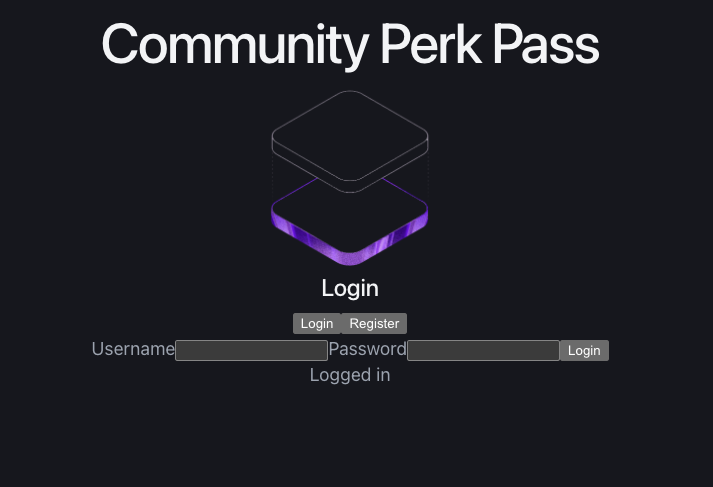
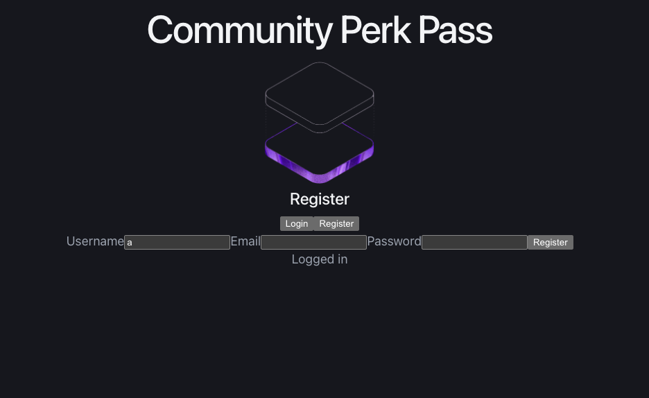
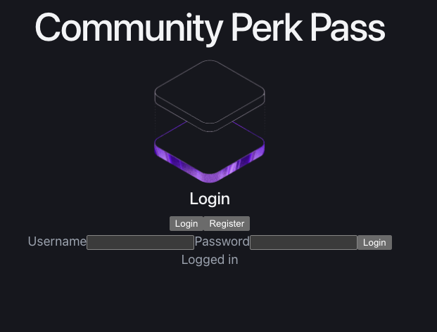

# Community Perk Pass

## Overview
Community Perk Pass is a subscription-based coupon platform designed to help users discover and save money at local small businesses. Users can create accounts, log in securely, and eventually access subscription-based coupon features.

## Problem Statement
Small businesses often struggle to attract repeat local customers, while community members may not know what deals and services are available nearby. Community Perk Pass aims to connect local customers with local businesses through a simple subscription coupon platform.

## Goals
- Build a full-stack web application from scratch
- Implement secure user authentication
- Support future features such as subscription plans, favorites, and coupon browsing
- Highlight and support small businesses in the community

## Core Features
- User registration
- User login
- Secure password hashing with bcrypt
- JWT-based authentication
- Persistent token storage in localStorage

## Distinguishing Features
- Focus on small business coupon discovery
- Subscription model for curated local deals
- Full-stack authentication flow built with React, Express, and PostgreSQL

## Tech Stack
### Frontend
- React
- Vite
- CSS

### Backend
- Node.js
- Express

### Database
- PostgreSQL

### Authentication
- bcrypt
- jsonwebtoken

### Tools
- Thunder Client
- Render
- GitHub
- VS Code

## Architecture Overview
```txt
client/
  src/
    components/
      AuthForm.jsx
      Hero.jsx
    App.jsx

server/
  db/
    client.js
    schema.sql
    queries/
      users.js
  routes/
    users.js
  utils/
    jwt.js
  index.js

  ## Screenshots

### Login Page


### Register Page


### Logged In State
